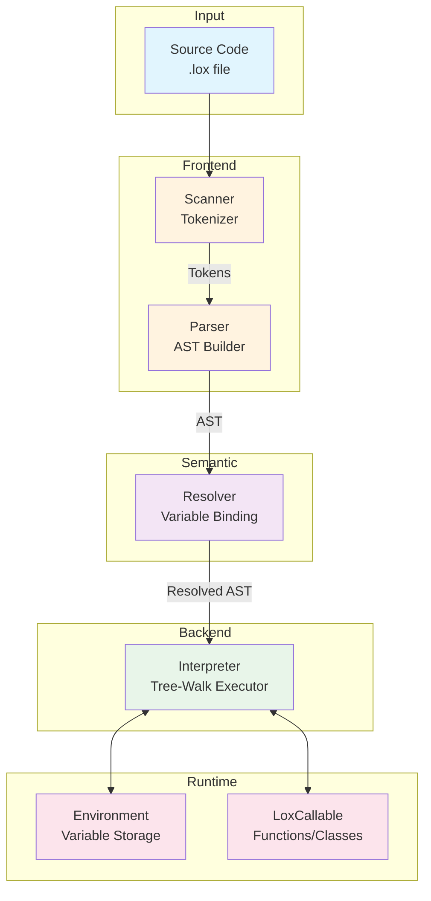
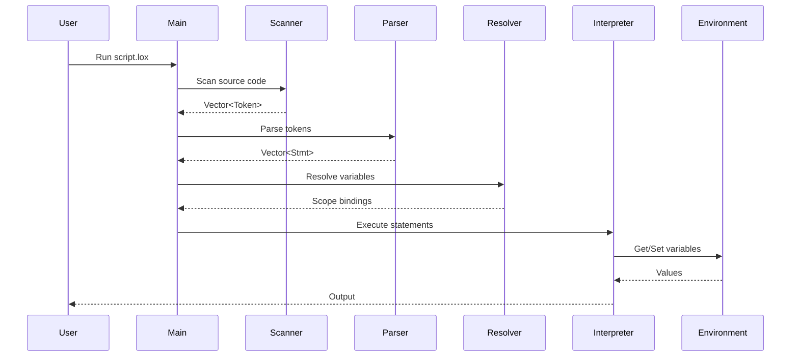
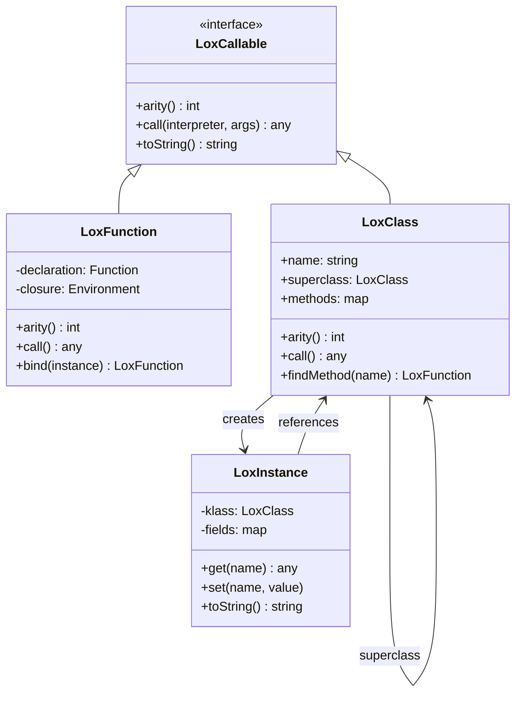

# 🌟 Lox Interpreter in C++

*Ik Puri Bhasha Interpreter (A Complete Language Interpreter)*

A fully-featured tree-walk interpreter for the [Lox programming language](https://craftinginterpreters.com/) implemented in modern C++17.

---

## 📋 Table of Contents

- [Features](#-features)
- [Quick Start](#-quick-start)
- [Architecture Overview](#-architecture-overview)
- [Code Flow](#-code-flow)
- [File Structure](#-file-structure)
- [Language Features](#-language-features)
- [Examples](#-examples)
- [Building](#-building)
- [Testing](#-testing)

---

## ✨ Features

| Feature | Status | Description |
|---------|--------|-------------|
| **Scanning** | ✅ | Tokenizes source code into lexemes |
| **Parsing** | ✅ | Builds Abstract Syntax Tree (AST) |
| **Expressions** | ✅ | Arithmetic, comparison, logical |
| **Statements** | ✅ | Print, var, block, if, while, for |
| **Functions** | ✅ | User-defined functions with closures |
| **Classes** | ✅ | OOP with methods and properties |
| **Inheritance** | ✅ | Class inheritance with `super` keyword |

---

## 🚀 Quick Start

```bash
# Clone and build
git clone <repository>
cd codecrafters-interpreter-cpp
cmake -B build -S .
cmake --build ./build

# Run a Lox script
./build/interpreter run script.lox
```

---

## 🏗️ Architecture Overview



---

## 🔄 Code Flow

### 1. Source to Output Pipeline



### 2. Class & Inheritance Model



---

## 📁 File Structure

```
src/
├── main.cpp              # Entry point - Command dispatch
├── Scanner.hpp/cpp       # Lexical analysis - Source → Tokens
├── Parser.hpp/cpp        # Syntax analysis - Tokens → AST
├── Expr.hpp              # Expression AST nodes
├── Stmt.hpp              # Statement AST nodes
├── Token.hpp             # Token representation
├── TokenType.hpp         # Token type enumeration
├── Resolver.hpp/cpp      # Static analysis - Variable binding
├── Interpreter.hpp/cpp   # Runtime - AST execution
├── Environment.hpp/cpp   # Variable storage with scoping
├── LoxCallable.hpp       # Interface for callable objects
├── LoxFunction.hpp/cpp   # User-defined functions
├── LoxClass.hpp/cpp      # Class definitions
├── LoxInstance.hpp/cpp   # Class instances
├── RuntimeError.hpp      # Runtime error handling
└── ReturnException.hpp   # Return statement handling
```

---

## 🎯 Language Features

### Variables & Data Types

```lox
var name = "Lox";        // Strings
var count = 42;          // Numbers
var active = true;       // Booleans
var nothing = nil;       // Nil (null)
```

### Control Flow

```lox
if (condition) {
    print "Yes";
} else {
    print "No";
}

for (var i = 0; i < 10; i = i + 1) {
    print i;
}

while (condition) {
    // loop body
}
```

### Functions & Closures

```lox
fun greet(name) {
    print "Hello, " + name + "!";
}

fun makeCounter() {
    var count = 0;
    fun increment() {
        count = count + 1;
        return count;
    }
    return increment;
}
```

### Classes & Inheritance

```lox
class Animal {
    speak() {
        print "Some sound";
    }
}

class Dog < Animal {
    speak() {
        super.speak();
        print "Woof!";
    }
}

var dog = Dog();
dog.speak();  // "Some sound" then "Woof!"
```

---

## 📝 Examples

### Hello World

```lox
print "Hello, World!";
```

### Fibonacci

```lox
fun fib(n) {
    if (n <= 1) return n;
    return fib(n - 2) + fib(n - 1);
}

for (var i = 0; i < 10; i = i + 1) {
    print fib(i);
}
```

### Class with Constructor

```lox
class Circle {
    init(radius) {
        this.radius = radius;
    }
    
    area() {
        return 3.14159 * this.radius * this.radius;
    }
}

var circle = Circle(5);
print circle.area();  // 78.53975
```

---

## 🔨 Building

### Requirements

- CMake 3.10+
- C++17 compatible compiler (GCC 7+, Clang 5+)

### Build Commands

```bash
# Configure
cmake -B build -S .

# Build
cmake --build ./build

# Run
./build/interpreter run <script.lox>
```

### Commands

| Command | Description |
|---------|-------------|
| `tokenize <file>` | Print tokens |
| `parse <file>` | Parse and check syntax |
| `evaluate <file>` | Evaluate single expression |
| `run <file>` | Execute full program |

---

## 🧪 Testing

```bash
# Run function tests
./build/interpreter run test_functions.lox

# Run class tests
./build/interpreter run test_classes.lox

# Run inheritance tests
./build/interpreter run test_inheritance.lox
```

---

## 📜 Comments Style

This codebase uses bilingual comments (Punjabi + English) for documentation:

```cpp
// Super di depth labho (Find the depth of super)
// Superclass labho (Get the superclass)
// Method nu current object naal bind karo (Bind the method to current object)
```

---

## 🙏 Acknowledgements

- [Crafting Interpreters](https://craftinginterpreters.com/) by Robert Nystrom
- [Codecrafters](https://codecrafters.io/) for the challenge

---

## 📄 License

MIT License
