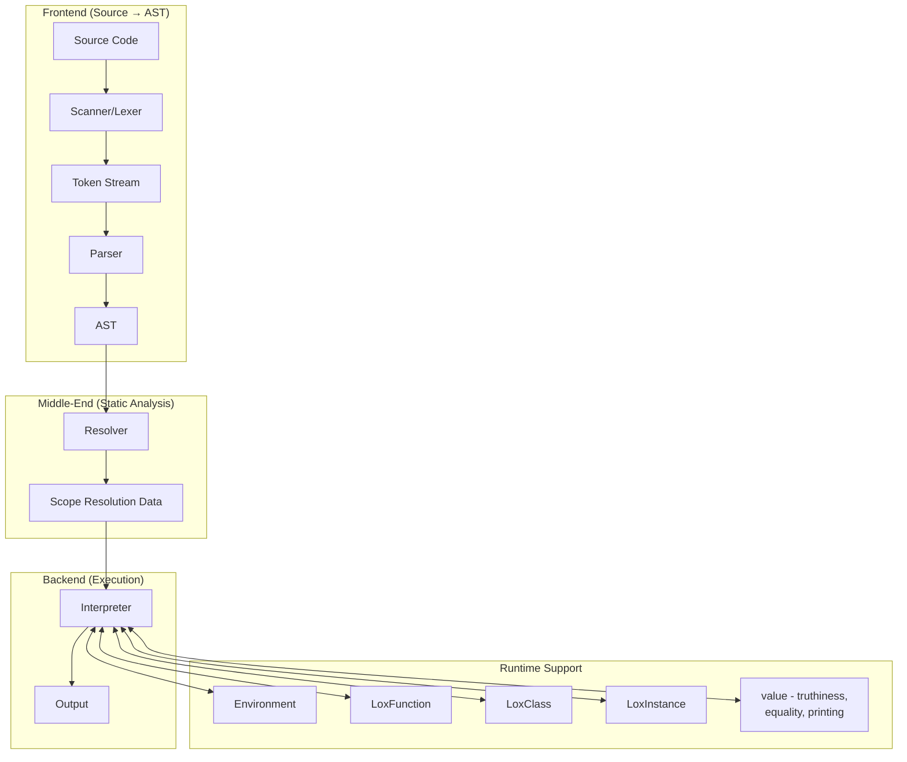
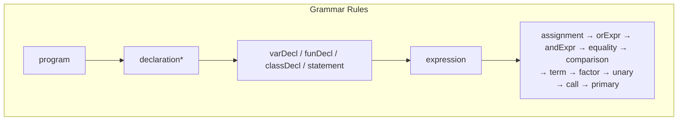
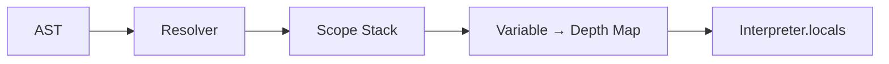
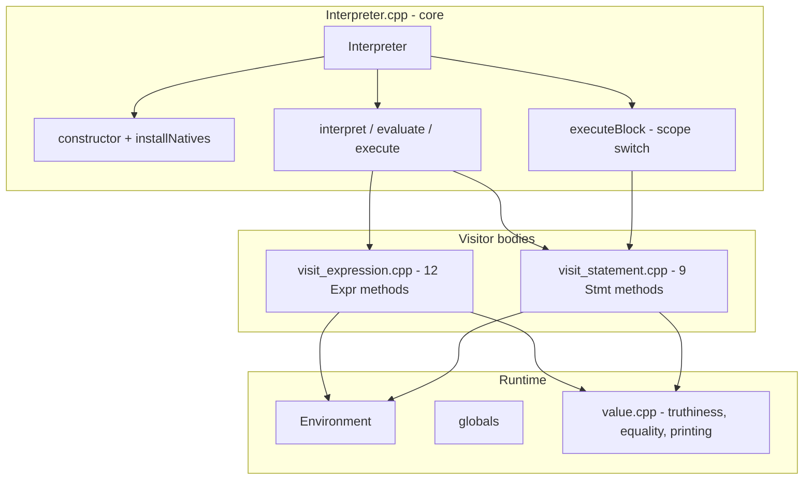
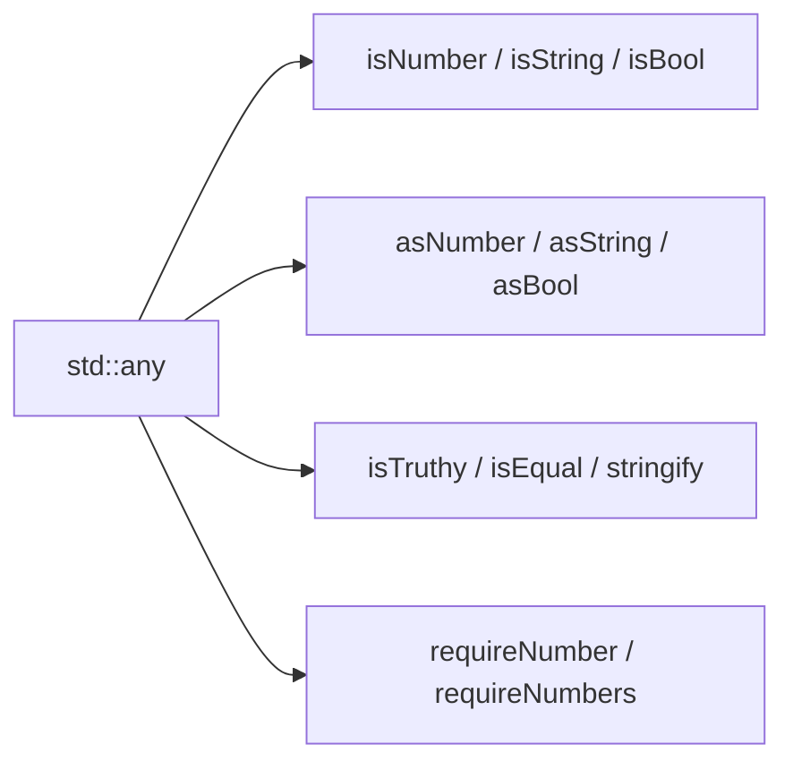
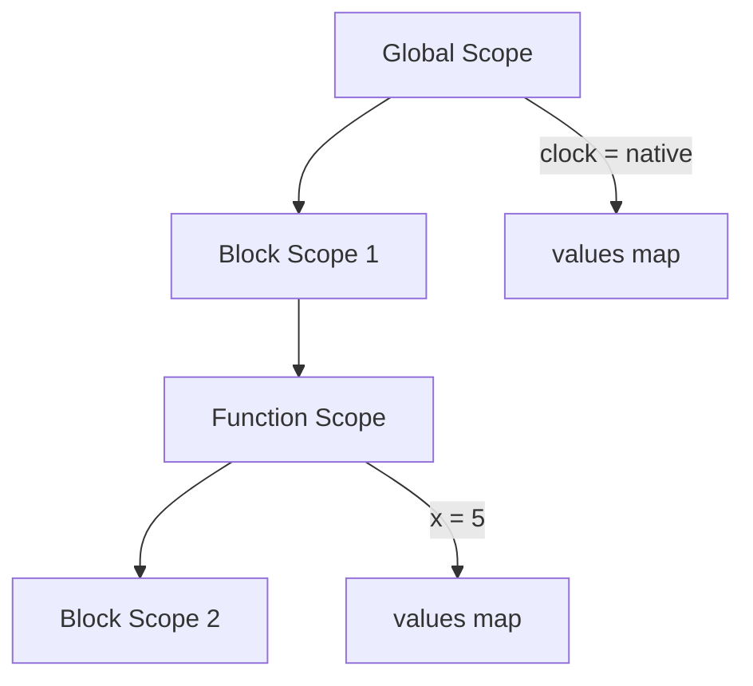
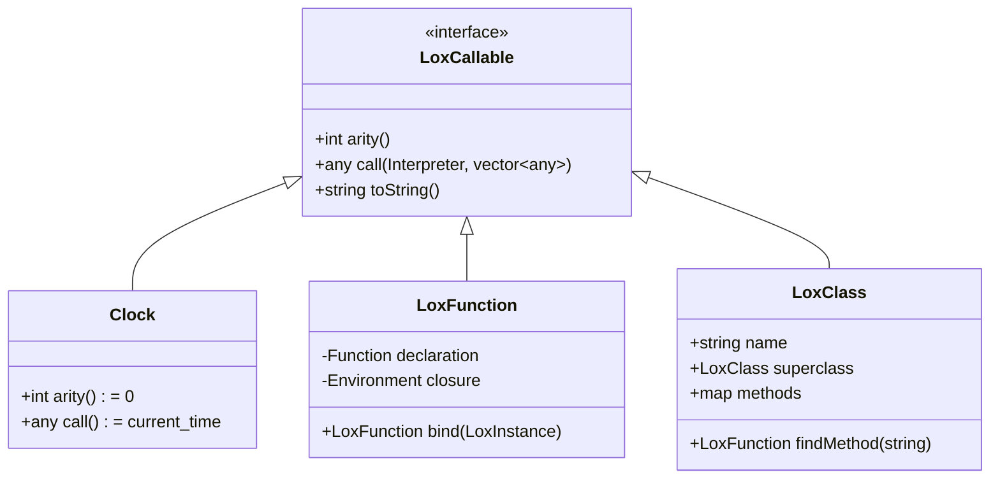
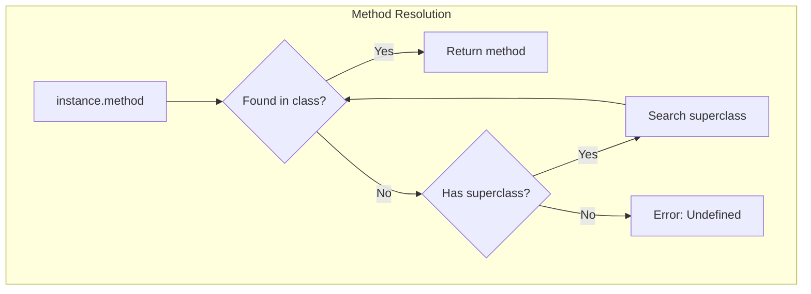
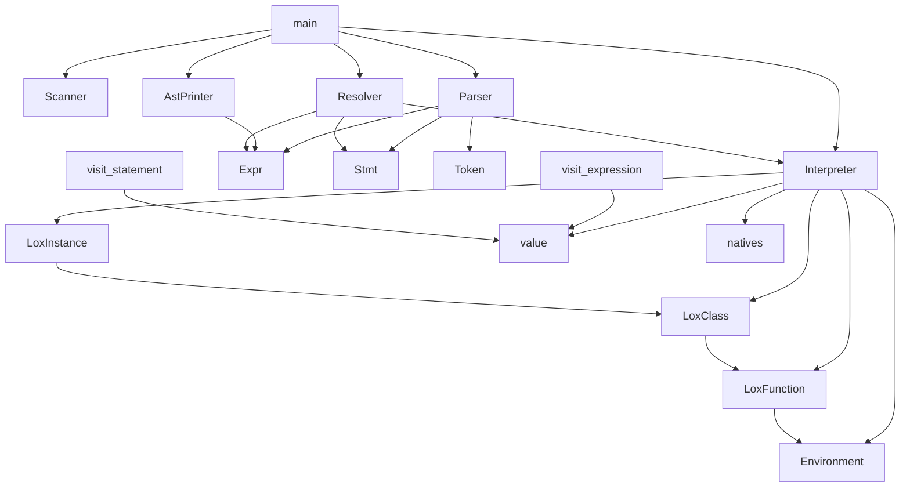

# 🏗️ Architecture Documentation

This document provides a detailed overview of the Lox interpreter architecture.

---

## 📊 System Architecture



A unidirectional pipeline: each layer calls only the one below it. `text →
tokens → tree → output`, and the data crossing each boundary is a plain value.
The Scanner never sees an `Expr`; the Resolver runs nothing; the Interpreter
never sees source text or a token.

The `Runtime Support` box is not a fifth layer. It is the object model the
backend executes against, and the backend is the only thing that touches it.

---

## 📦 Component Details

### 1. Scanner (Lexer)

**Purpose**: Converts raw source code into a sequence of tokens.

**Files**: `Scanner.hpp`, `Scanner.cpp`

```mermaid
flowchart LR
    A["print \"hello\";"] --> B[Scanner]
    B --> C["[PRINT] [STRING:hello] [SEMICOLON] [EOF]"]
```

**Key Methods**:
- `scanTokens()` - Main entry, returns `vector<Token>`
- `scanToken()` - Scans a single token
- `string()` - Handles string literals
- `number()` - Handles numeric literals
- `identifier()` - Handles identifiers and keywords

---

### 2. Parser

**Purpose**: Builds an Abstract Syntax Tree (AST) from tokens using recursive descent
with a hand-written precedence chain. There is no Nud/Led table in this codebase.

**Files**: `Parser.hpp`, `Parser.cpp`, `Expr.hpp`, `Stmt.hpp`



**Key Classes**:

| Class | Description |
|-------|-------------|
| `Expr` | Base class for all expressions |
| `Binary` | `a + b`, `a == b` |
| `Unary` | `-a`, `!a` |
| `Literal` | `42`, `"hello"`, `true` |
| `Variable` | Variable references |
| `Assign` | `a = 5` |
| `Call` | `foo(a, b)` |
| `Get` | `obj.property` |
| `Set` | `obj.property = value` |
| `This` | `this` keyword |
| `Super` | `super.method` |
| `Logical` | `a and b`, `a or b` |

---

### 3. Resolver

**Purpose**: Static analysis pass that resolves variable scopes before interpretation.

**Files**: `Resolver.hpp`, `Resolver.cpp`



**How it works**:
1. Walks the AST before interpretation
2. Maintains a stack of scopes
3. For each variable, records how many scopes away it was declared
4. Stores this information in `Interpreter.locals`

---

### 4. Interpreter

**Purpose**: Executes the AST using the visitor pattern.

**Files**: `Interpreter.hpp` (contract), `Interpreter.cpp` (core),
`visit_expression.cpp` (12 `ExprVisitor` bodies),
`visit_statement.cpp` (9 `StmtVisitor` bodies)

The header is the whole public surface: `globals`, `environment`, `locals`, and
21 virtual overrides. The implementation is split by concern, so no single file
holds all of it.



**Division of labour**:
- `executeBlock` owns the current scope. It swaps `environment`, runs the
  statements, and restores the previous scope even when a statement unwinds
  through it — that is how `return` gets out of nested blocks.
- The `visit*` methods never touch `environment` directly for scoping. They read
  and write bindings through it at a depth the Resolver already computed.
- Value questions go to `value.cpp`, not to the walker.

---

### 5. value — what a Lox value is

**Purpose**: The single place that answers "what is this `std::any`?".

**Files**: `value.hpp`, `value.cpp`

Lox has no tagged union. A runtime value is a `std::any` holding one of: nil (an
empty `std::any`), `bool`, `double`, `std::string`, or a `shared_ptr` to
`LoxClass`, `LoxInstance` or `LoxFunction`. Natives are held as a
`shared_ptr<LoxCallable>`.



Before this was its own module, five helpers were private members of
`Interpreter` even though none of them touched `this->`. Keeping them here means
"can this be truthy", "are these equal" and "how does this print" have one
answer each, and a new caller cannot invent a fourth.

`stringify`'s unknown-type path throws. It used to return the string
`"unknown"`, which would have printed a plausible-looking word for a bug in the
interpreter.

---

### 6. natives

**Purpose**: Installs the built-in functions into the global environment.

**Files**: `natives.hpp`, `natives.cpp`

`installNatives(Environment&)` is the whole registry. `Clock` lives in an
anonymous namespace in the `.cpp`, so adding a native is one class plus one
`globals.define` line — the parser, resolver and tree walker need no change.

---

### 7. Environment

**Purpose**: Stores variables in a scoped chain.

**Files**: `Environment.hpp`, `Environment.cpp`



**Key Features**:
- `enclosing` pointer forms a linked list of scopes
- `getAt(distance, name)` for resolved variable lookup
- `ancestor(distance)` for scope hopping
- `getSlotOrFail(distance, token, slot)` for the interpreter's own slots (`this`,
  `super`)

**Why two lookup functions.** `getAt`/`assignAt` run on every variable read and
assume the distance is in range, because the Resolver proved the slot exists. A
miss there would be an interpreter bug, and checking on the hot path would cost
every read in the program. `getSlotOrFail` is for `this` and `super`, where a
miss means the interpreter lost track of the scope chain rather than that the
program is wrong. It walks the chain itself instead of using `ancestor` — which
assumes the distance is in range and would dereference a null `enclosing` — and
throws a located error instead of letting `map::operator[]` insert an empty `any`.

---

### 8. LoxCallable Hierarchy



`LoxCallable` is why `visitCallExpr` can dispatch a call without knowing which
kind of callable it got. `Clock` is not a separate public type — it is a
class in an anonymous namespace inside `natives.cpp`, reachable only as a
`shared_ptr<LoxCallable>`.

---

### 9. Inheritance Model



**super Keyword Execution** (`visitSuperExpr`):
1. Look up the `Super` node in `locals`. Absent means the Resolver never
   annotated it, so throw "Can't use 'super' outside of a class". The lookup is
   checked: this function used to dereference `end()` and segfault.
2. Get `super` at the resolved distance via `getSlotOrFail`
3. Get `this` at `distance - 1` via `getSlotOrFail`
4. Find the method in the superclass, walking up the chain
5. Bind the method to the current instance

Both slot reads use `getSlotOrFail`, so a `this` that is not where the Resolver
said it would be is a reported error rather than a nil that surfaces later as a
segfault in `method->bind`.

---

## 🔗 Inter-File Dependencies



Two arrows point *back up* here, and both are the object model rather than the
pipeline: `LoxCallable` forward-declares `lox::Interpreter` because `call()`
receives one, and `LoxInstance` forward-declares `lox::LoxClass` because it
holds one. Neither is a layer reaching backwards — the data flow
`text → tokens → tree → output` is strictly downward.

---

## 📝 Memory Management

The interpreter uses `std::shared_ptr` extensively:
- **Environment chains** - Allows closures to capture enclosing scopes
- **AST nodes** - Shared ownership during parsing and interpretation
- **LoxClass/LoxInstance** - Instances reference their class

`Interpreter::locals` is a `std::map<Expr*, int>` keyed by raw pointer, which
means the AST has to outlive the map. It does: the statements vector is owned by
`main` and lives for the whole run.

---

## 🎭 Visitor Pattern

Both `Expr` and `Stmt` use the visitor pattern. Every `visit*` is pure virtual,
so a new node type is a compile error until every visitor implements it — which
is the mechanism that stopped the `parse` command from printing `"unknown"`.

```cpp
// Base class declares the dispatch. The body lives in Expr.cpp / Stmt.cpp, not
// in the header, so the header stays a pure contract.
class Expr {
    virtual std::any accept(ExprVisitor& visitor) = 0;
};

class Binary : public Expr {
    std::any accept(ExprVisitor& visitor) override;
};

// Three visitors implement the same two interfaces:
//   Interpreter  - runs the program        (split across 3 .cpp files)
//   Resolver     - computes scope depths  (Resolver.cpp)
//   AstPrinter   - renders it as text     (AstPrinter.cpp)
```

There are three classes over the same tree, and that is the point of the pattern here: the
tree walk, the scope analysis and the text rendering are separate concerns over
one AST shape, and adding a node forces all three to be updated. `AstPrinter`
implements only `ExprVisitor`, so a new *statement* node only forces updates to
the resolver and the interpreter.

---

## 🔄 Execution Flow Example

For the code: `print 1 + 2;`

```mermaid
sequenceDiagram
    participant M as main()
    participant S as Scanner
    participant P as Parser
    participant I as Interpreter
    
    M->>S: scanTokens("print 1 + 2;")
    S-->>M: [PRINT, 1, PLUS, 2, SEMICOLON, EOF]
    
    M->>P: parse(tokens)
    P-->>M: PrintStmt(Binary(1, +, 2))
    
    M->>I: interpret(statements)
    I->>I: visitPrintStmt()
    I->>I: evaluate(Binary)
    I->>I: visitBinaryExpr()
    I->>I: evaluate(1) = 1.0
    I->>I: evaluate(2) = 2.0
    I->>I: 1.0 + 2.0 = 3.0
    I-->>M: print "3"
```
