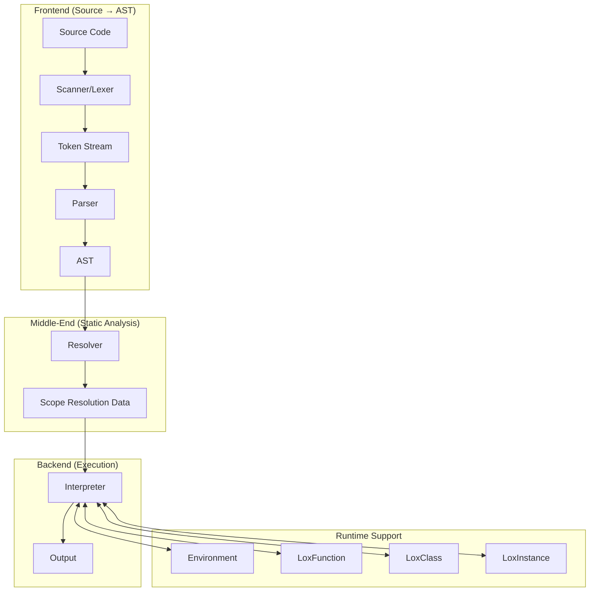
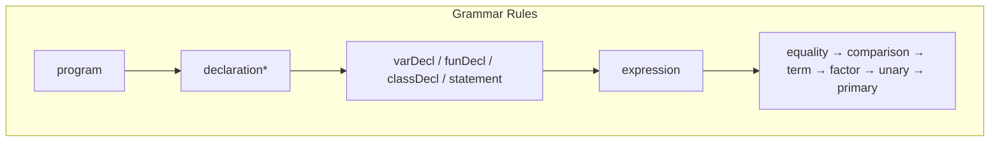
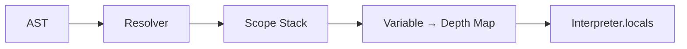
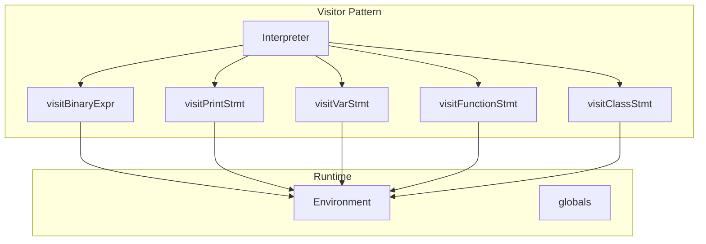
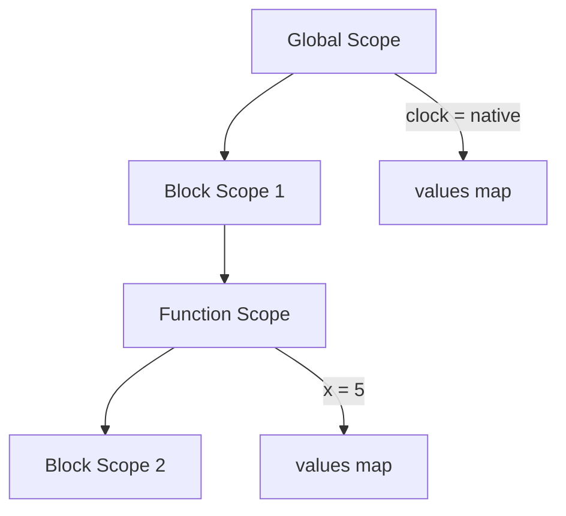
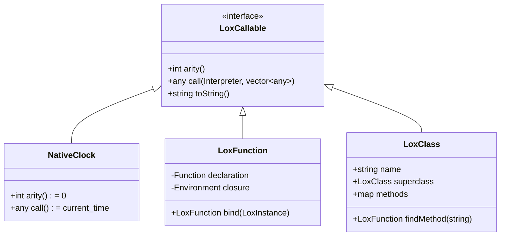
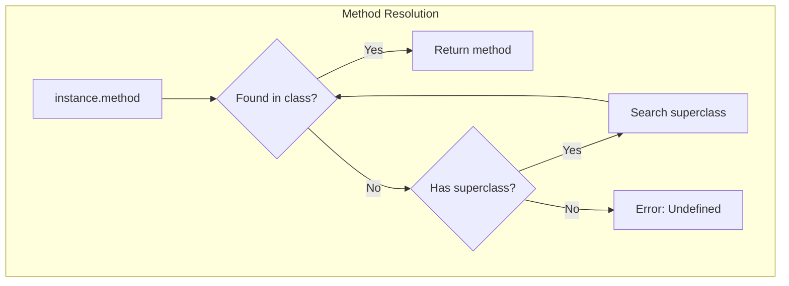
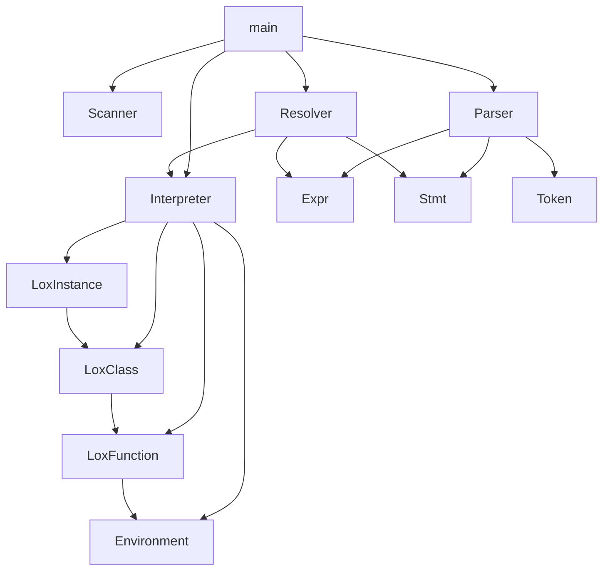

# 🏗️ Architecture Documentation

This document provides a detailed overview of the Lox interpreter architecture.

---

## 📊 System Architecture



---

## 📦 Component Details

### 1. Scanner (Lexer)

**Purpose**: Converts raw source code into a sequence of tokens.

**Files**: `Scanner.hpp`, `Scanner.cpp`

```mermaid
flowchart LR
    A["print \"hello\";"] --> B[Scanner]
    B --> C["[PRINT] [STRING:hello] [SEMICOLON] [EOF]"]
```

**Key Methods**:
- `scanTokens()` - Main entry, returns `vector<Token>`
- `scanToken()` - Scans a single token
- `string_()` - Handles string literals
- `number()` - Handles numeric literals
- `identifier()` - Handles identifiers and keywords

---

### 2. Parser

**Purpose**: Builds an Abstract Syntax Tree (AST) from tokens using recursive descent.

**Files**: `Parser.hpp`, `Parser.cpp`, `Expr.hpp`, `Stmt.hpp`



**Key Classes**:

| Class | Description |
|-------|-------------|
| `Expr` | Base class for all expressions |
| `Binary` | `a + b`, `a == b` |
| `Unary` | `-a`, `!a` |
| `Literal` | `42`, `"hello"`, `true` |
| `Variable` | Variable references |
| `Assign` | `a = 5` |
| `Call` | `foo(a, b)` |
| `Get` | `obj.property` |
| `Set` | `obj.property = value` |
| `This` | `this` keyword |
| `Super` | `super.method` |

---

### 3. Resolver

**Purpose**: Static analysis pass that resolves variable scopes before interpretation.

**Files**: `Resolver.hpp`, `Resolver.cpp`



**How it works**:
1. Walks the AST before interpretation
2. Maintains a stack of scopes
3. For each variable, records how many scopes away it was declared
4. Stores this information in `Interpreter.locals`

---

### 4. Interpreter

**Purpose**: Executes the AST using the visitor pattern.

**Files**: `Interpreter.hpp`, `Interpreter.cpp`



---

### 5. Environment

**Purpose**: Stores variables in a scoped chain.

**Files**: `Environment.hpp`, `Environment.cpp`



**Key Features**:
- `enclosing` pointer forms a linked list of scopes
- `getAt(distance, name)` for resolved variable lookup
- `ancestor(distance)` for scope hopping

---

### 6. LoxCallable Hierarchy



---

### 7. Inheritance Model



**super Keyword Execution**:
1. Get `super` from environment at resolved distance
2. Get `this` from one level above `super`
3. Find method in superclass
4. Bind method to current instance

---

## 🔗 Inter-File Dependencies



---

## 📝 Memory Management

The interpreter uses `std::shared_ptr` extensively:
- **Environment chains** - Allows closures to capture enclosing scopes
- **AST nodes** - Shared ownership during parsing and interpretation
- **LoxClass/LoxInstance** - Instances reference their class

---

## 🎭 Visitor Pattern

Both `Expr` and `Stmt` use the visitor pattern:

```cpp
// Base class defines accept
class Expr {
    virtual std::any accept(ExprVisitor& visitor) = 0;
};

// Each subclass implements accept
class Binary : public Expr {
    std::any accept(ExprVisitor& visitor) override {
        return visitor.visitBinaryExpr(*this);
    }
};

// Interpreter implements visitor
class Interpreter : public ExprVisitor, public StmtVisitor {
    std::any visitBinaryExpr(Binary& expr) override {
        // Evaluate binary expression
    }
};
```

---

## 🔄 Execution Flow Example

For the code: `print 1 + 2;`

```mermaid
sequenceDiagram
    participant M as main()
    participant S as Scanner
    participant P as Parser
    participant I as Interpreter
    
    M->>S: scanTokens("print 1 + 2;")
    S-->>M: [PRINT, 1, PLUS, 2, SEMICOLON, EOF]
    
    M->>P: parse(tokens)
    P-->>M: PrintStmt(Binary(1, +, 2))
    
    M->>I: interpret(statements)
    I->>I: visitPrintStmt()
    I->>I: evaluate(Binary)
    I->>I: visitBinaryExpr()
    I->>I: evaluate(1) = 1.0
    I->>I: evaluate(2) = 2.0
    I->>I: 1.0 + 2.0 = 3.0
    I-->>M: print "3"
```
