# 🔄 Code Flow Documentation

This document explains how code flows through the Lox interpreter from source to output.

---

## 📍 Entry Point

### main.cpp

The entry point dispatches to different modes:

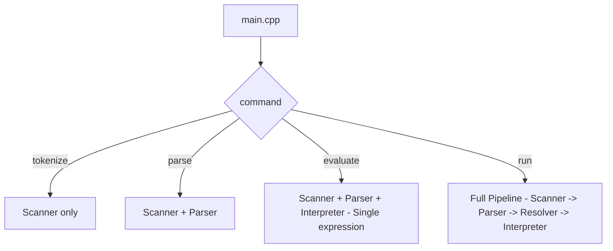

---

## 🔍 Complete Execution Flow

### For a simple program:

```lox
var x = 10;
print x + 5;
```

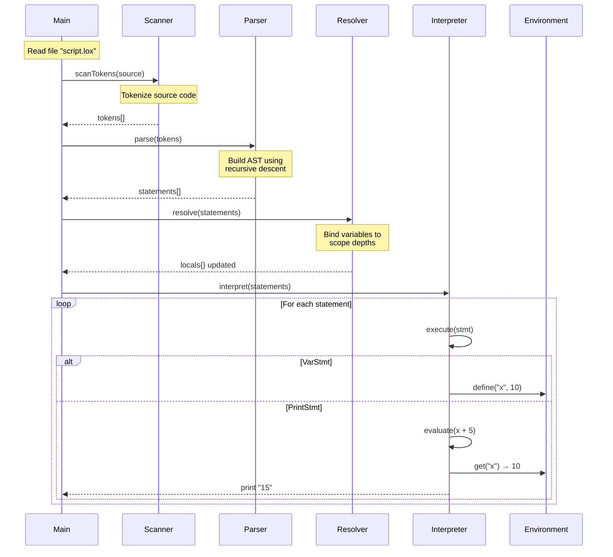

---

## 📝 Phase 1: Scanning (Lexical Analysis)

**File**: `Scanner.hpp`, `Scanner.cpp`

### Input → Output

```
Input:  "var x = 10;"
Output: [VAR] [IDENTIFIER:x] [EQUAL] [NUMBER:10] [SEMICOLON] [EOF]
```

### Flow

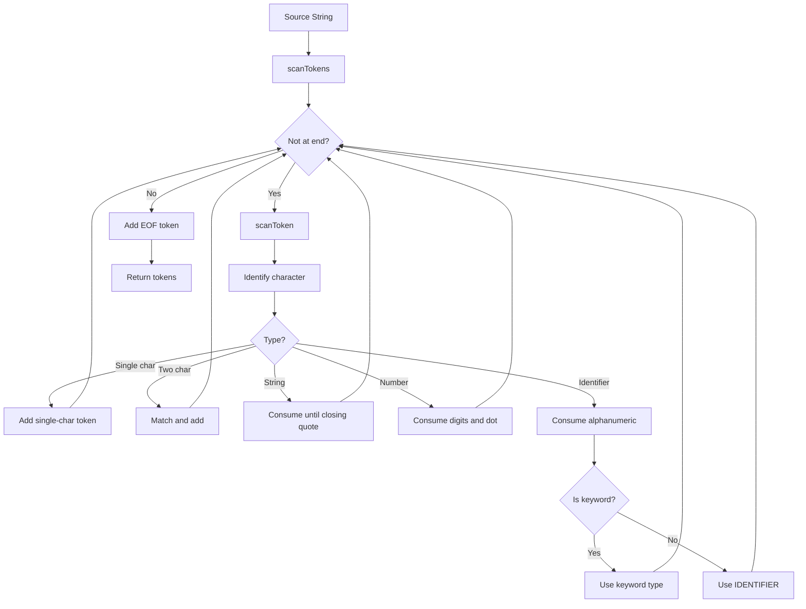

---

## 📝 Phase 2: Parsing (Syntax Analysis)

**Files**: `Parser.hpp`, `Parser.cpp`, `Expr.hpp`, `Stmt.hpp`

### Grammar Hierarchy

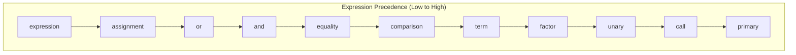

### Parsing Example: `x = 1 + 2 * 3`

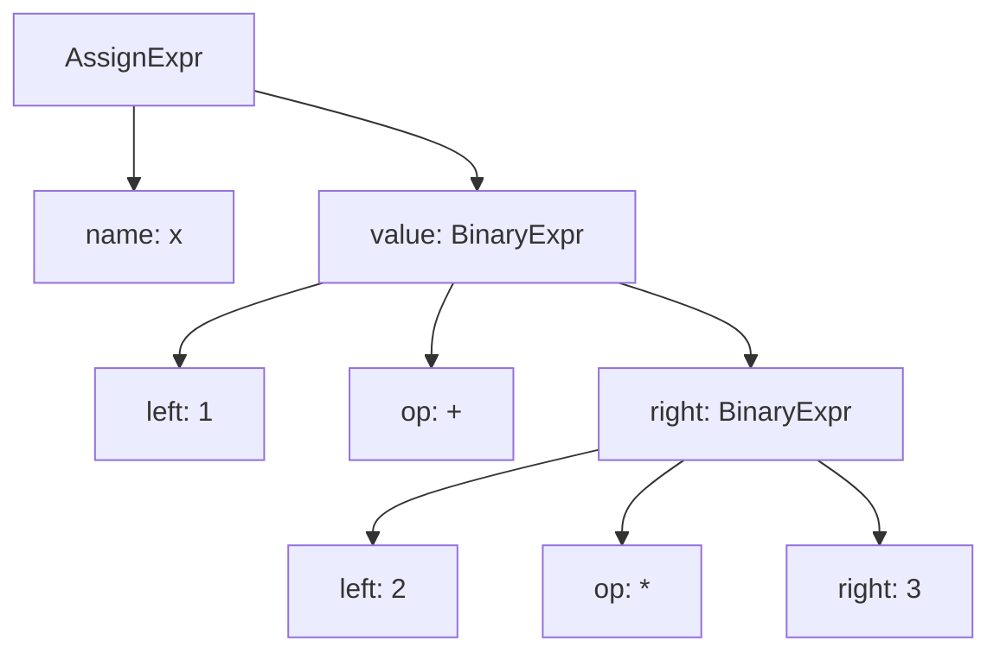

---

## 📝 Phase 3: Resolving (Static Analysis)

**Files**: `Resolver.hpp`, `Resolver.cpp`

### Purpose

Resolves variable references to their declaration scope **before** interpretation.

### How Scopes Work

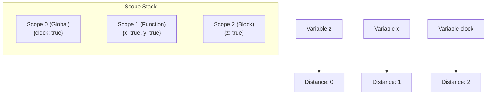

### Resolution Process

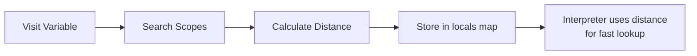

---

## 📝 Phase 4: Interpretation (Execution)

**Files**: `Interpreter.hpp`, `Interpreter.cpp`

### Visitor Pattern Execution

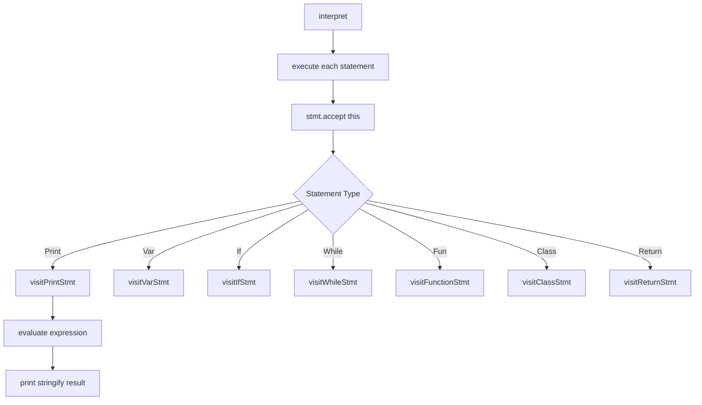

---

## 🔧 Environment Chain

### How Variables are Stored

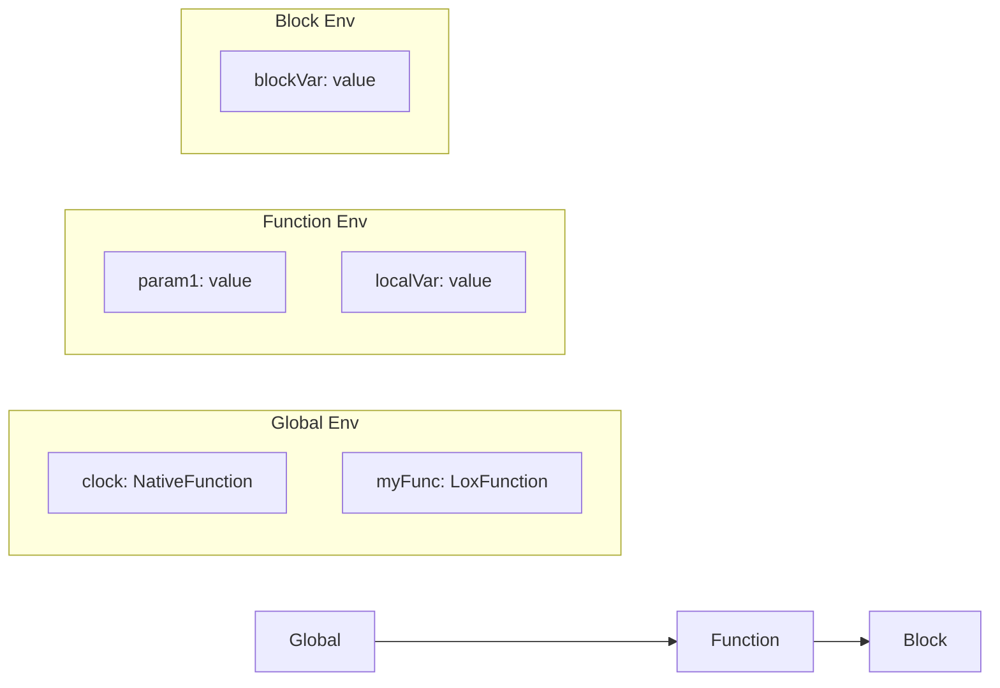

### Variable Lookup with Resolution

```cpp
// Without resolution (slow - walks chain)
environment->get(token);

// With resolution (fast - jumps directly)
auto it = locals.find(&expr);
if (it != locals.end()) {
    return environment->getAt(it->second, name);
}
```

---

## 🎯 Function Call Flow

### For: `add(1, 2)`

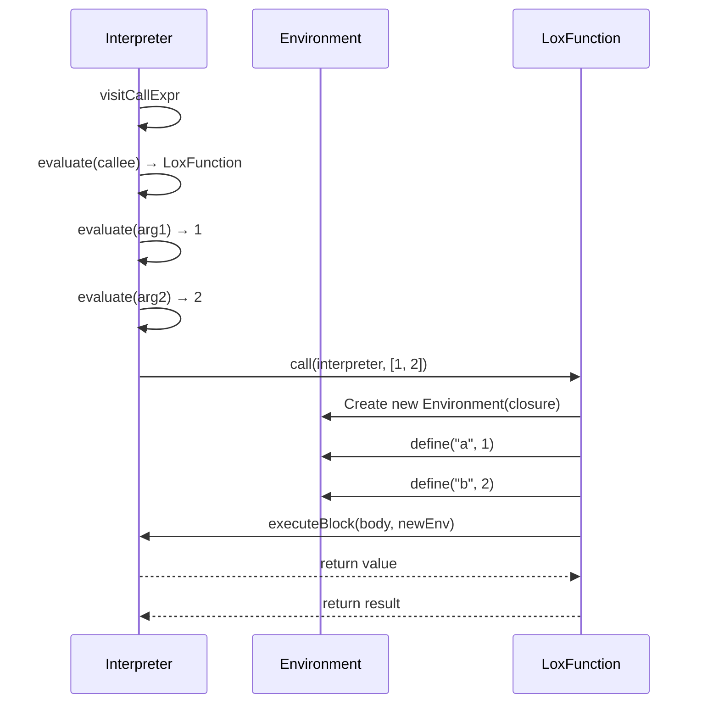

---

## 🎓 Class Instantiation Flow

### For: `var dog = Dog();`

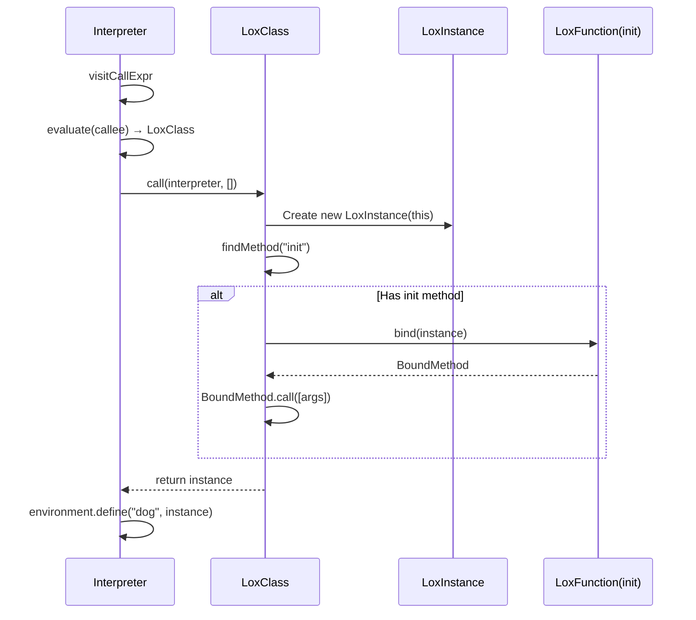

---

## 🔗 Inheritance and Super

### super.method() Execution

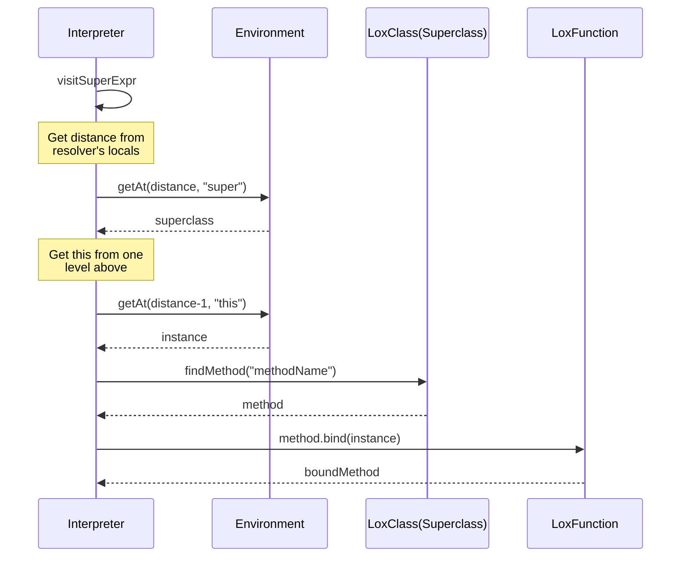

---

## 📊 Complete Data Flow Diagram

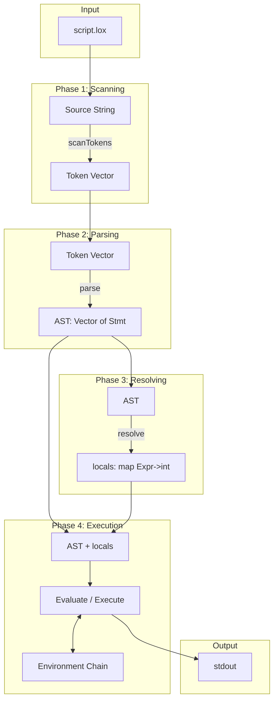

---

## 🔚 Error Handling Flow

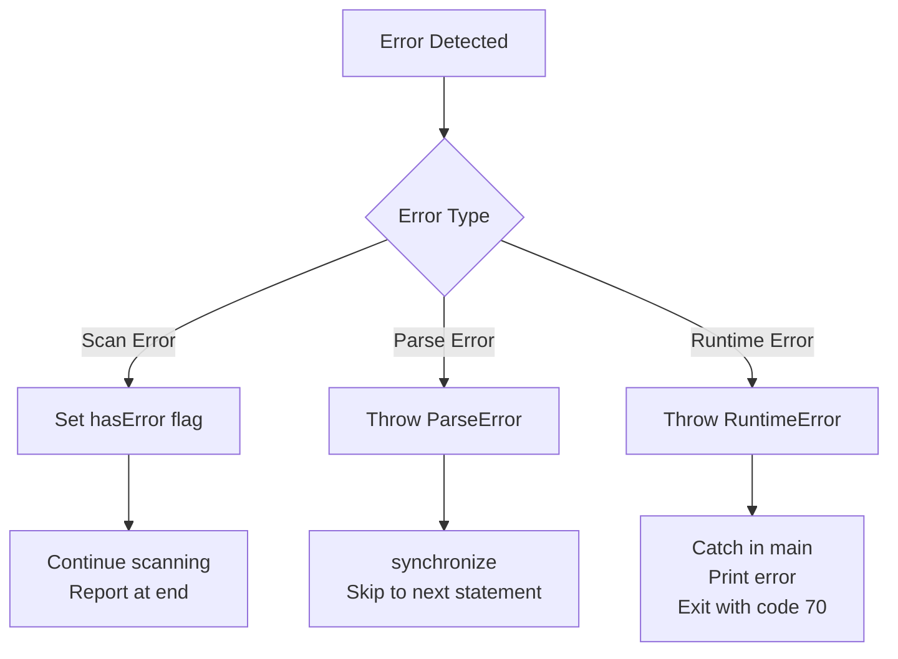
