# 🔄 Code Flow Documentation

This document explains how code flows through the Lox interpreter from source to output.

Every declaration in the project lives in `namespace lox`. `main` is the one
exception, because it has to be at global scope.

---

## 📍 Entry Point

### main.cpp

`main` does three things: unbuffer the streams, read `argv[1]`, dispatch. It holds
no domain logic — the AST printer that used to live here is now `AstPrinter.cpp`
and the value formatting is in `value.cpp`.

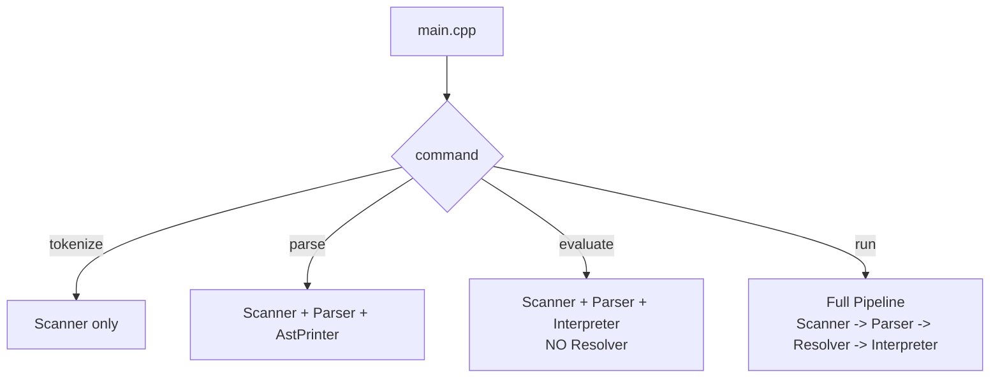

`evaluate` skips the Resolver, which matters for error handling: the Resolver's
compile-time rules (`this` outside a class, a value returned from an
initializer) are not enforced on that path, so the runtime checks in
`visitThisExpr`, `visitSuperExpr` and `LoxFunction::call` have to stand on their
own. They do.

---

## 🔍 Complete Execution Flow

### For a simple program:

```lox
var x = 10;
print x + 5;
```

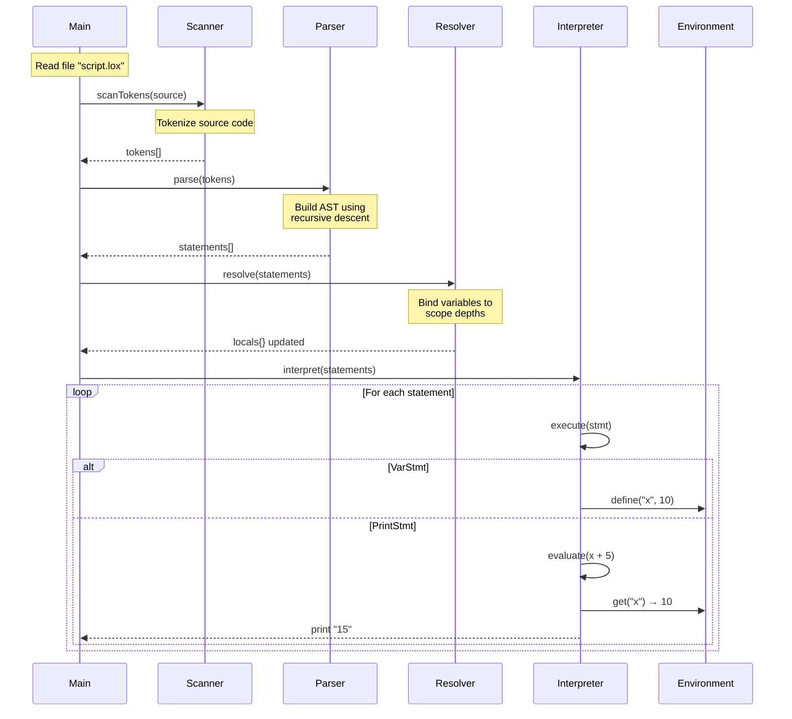

---

## 📝 Phase 1: Scanning (Lexical Analysis)

**Files**: `Scanner.hpp`, `Scanner.cpp`, `Token.hpp`, `Token.cpp`, `TokenType.hpp`, `TokenType.cpp`

### Input → Output

```
Input:  "var x = 10;"
Output: [VAR] [IDENTIFIER:x] [EQUAL] [NUMBER:10] [SEMICOLON] [EOF]
```

### Flow

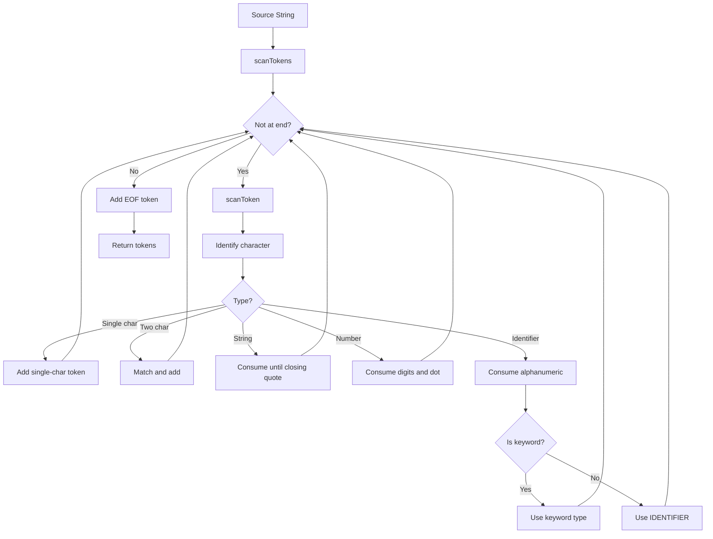

---

## 📝 Phase 2: Parsing (Syntax Analysis)

**Files**: `Parser.hpp`, `Parser.cpp`, `Expr.hpp`, `Expr.cpp`, `Stmt.hpp`, `Stmt.cpp`, `AstPrinter.hpp`, `AstPrinter.cpp`

`Parser::kMaxArity` (255) caps both parameter and argument lists. Both checks used
to be commented-out `error()` calls, so the limit was tested and then discarded.

### Grammar Hierarchy

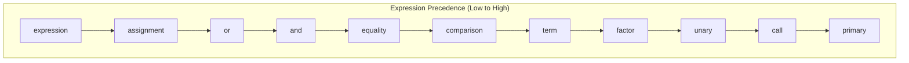

### Parsing Example: `x = 1 + 2 * 3`

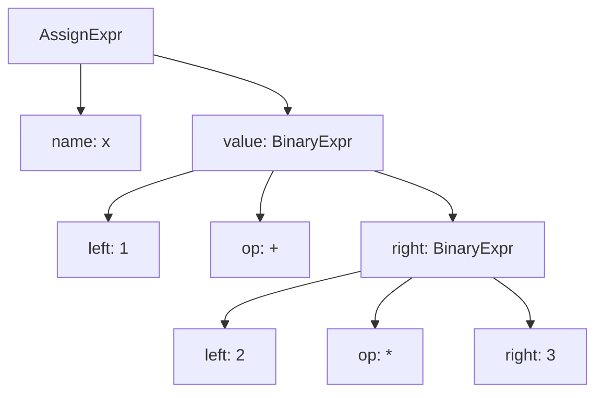

---

## 📝 Phase 3: Resolving (Static Analysis)

**Files**: `Resolver.hpp`, `Resolver.cpp`

### Purpose

Resolves variable references to their declaration scope **before** interpretation.

### How Scopes Work

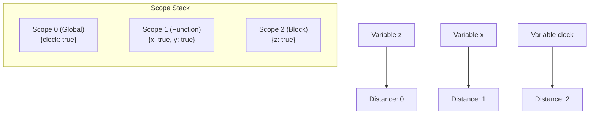

### Resolution Process

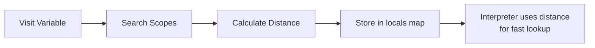

---

## 📝 Phase 4: Interpretation (Execution)

**Files**: `Interpreter.hpp` (contract), `Interpreter.cpp` (core),
`visit_expression.cpp`, `visit_statement.cpp`, `value.cpp`, `natives.cpp`

### Visitor Pattern Execution

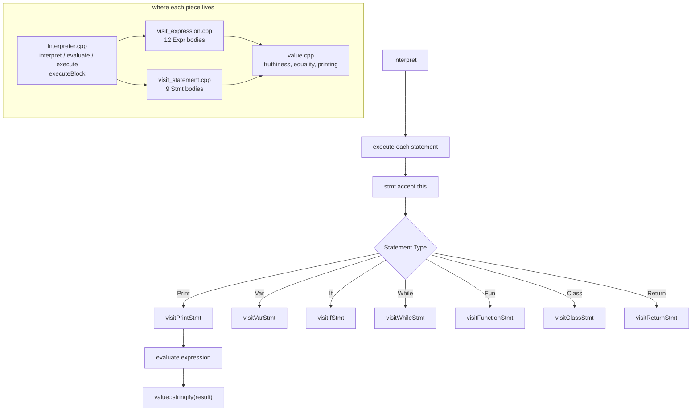

Expression bodies never change the current scope. Statement bodies do, and they
all do it through `executeBlock`, which saves `environment`, swaps in the new
one, runs, and restores it even when a statement unwinds. That restore-on-throw
is what lets `return` escape from inside a nested block.

---

## 🔧 Environment Chain

### How Variables are Stored

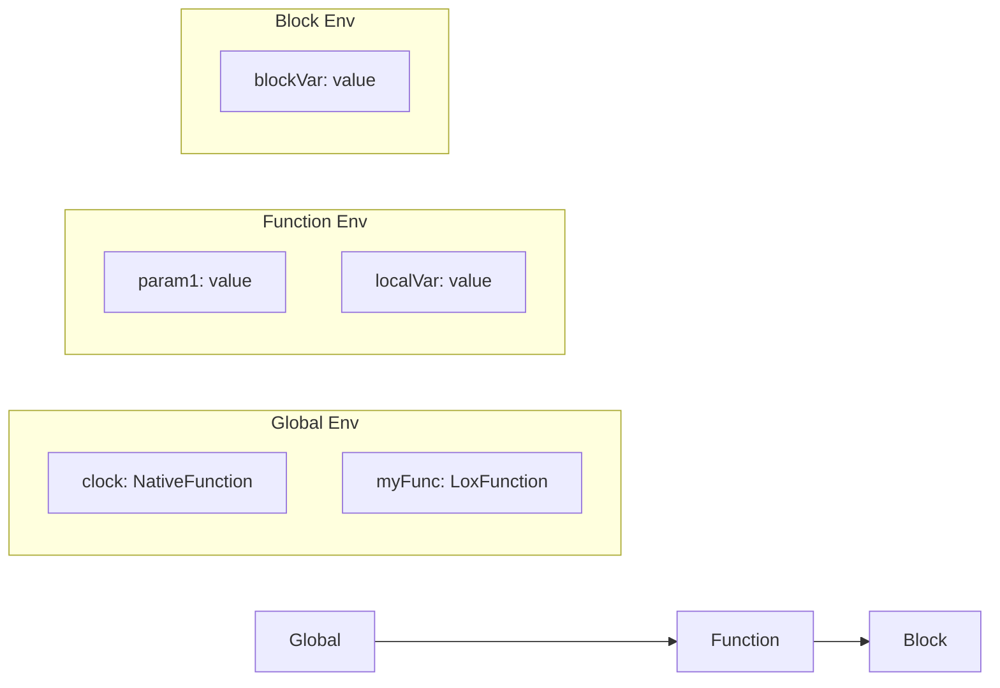

### Variable Lookup with Resolution

```cpp
// Without resolution (slow - walks chain)
environment->get(token);

// With resolution (fast - jumps directly)
auto it = locals.find(&expr);
if (it != locals.end()) {
    return environment->getAt(it->second, name);
}
```

`locals` is filled in by the Resolver before anything runs, keyed by `Expr*`.
A node absent from the map is a global. Every `locals.find` result is checked
against `end()` — `visitSuperExpr` used to skip that check and segfault when the
`super` expression had not been annotated.

For the interpreter's own slots the read is `getSlotOrFail`, which throws a
located error on a miss instead of letting `map::operator[]` insert an empty
`any`:

```cpp
// `this` and `super` are created by the interpreter, not the program, so a
// miss means it lost track of the scope chain.
return environment->getSlotOrFail(distance, expr.keyword, "super");
```

---

## 🎯 Function Call Flow

### For: `add(1, 2)`

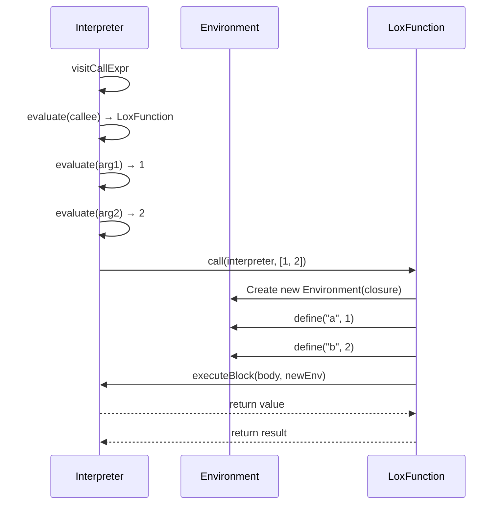

---

## 🎓 Class Instantiation Flow

### For: `var dog = Dog();`

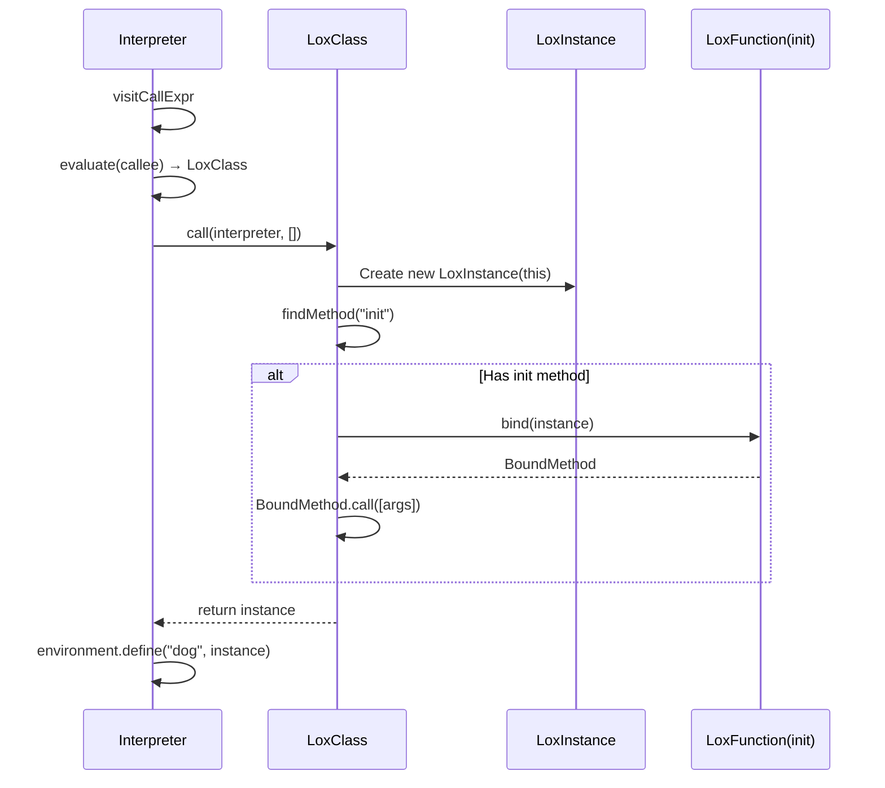

---

## 🔗 Inheritance and Super

### super.method() Execution

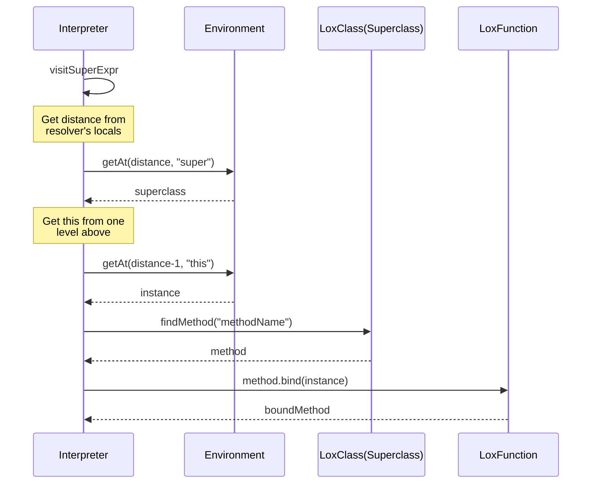

---

## 📊 Complete Data Flow Diagram

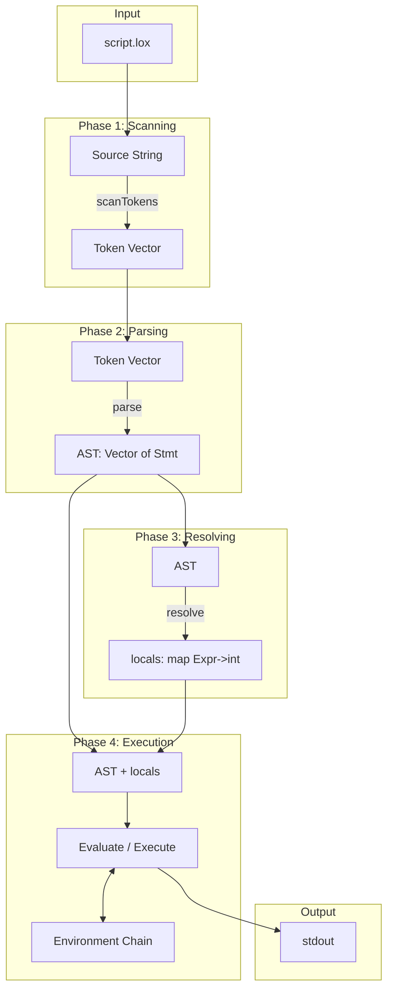

---

## 🔚 Error Handling Flow

Three kinds of error, three exit codes. The CodeCrafters harness checks the code
and matches the message text literally, so both are part of the contract.

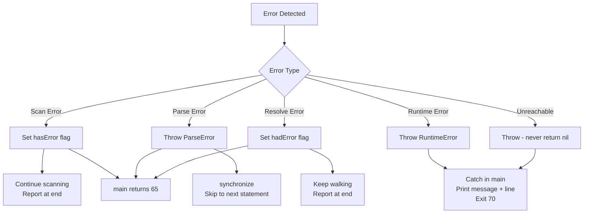

**Streams.** Diagnostics go to stderr; program output and `print` go to stdout.
The harness compares them separately *and* their interleaving, so a diagnostic
printed to stdout, or a `print` sent to stderr, fails a stage.

**Two rules for new errors.**

1. Pass the token the message should point at. `RuntimeError` prints `[line N]`
   from that token and the harness checks the number. For a binary operator that
   is the operator token, not an operand.
2. The unreachable branch throws. Returning an empty `std::any` from
   `visitUnaryExpr` or `visitBinaryExpr`, or the string `"unknown"` from
   `stringify`, produces output that looks like a valid program result and hides
   the bug underneath. Both now throw.

**Scope-lookup safety.** `Environment` has two lookup paths. `getAt`/`assignAt`
are unchecked because the Resolver proved the slot exists and they run on every
variable read. `getSlotOrFail` is checked and used for `this` and `super`, where
a miss means the interpreter lost track of the scope chain. It walks the chain
itself rather than through `ancestor()`, which assumes the distance is in range
and dereferences a null `enclosing` past the end.
